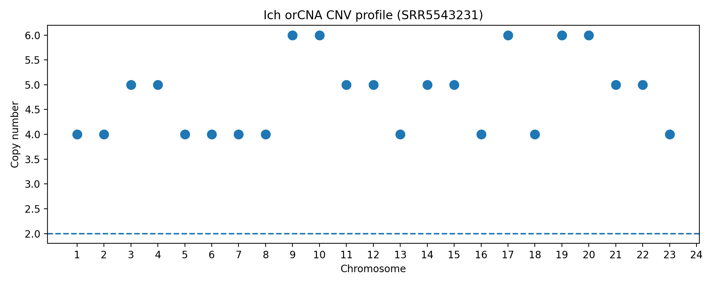
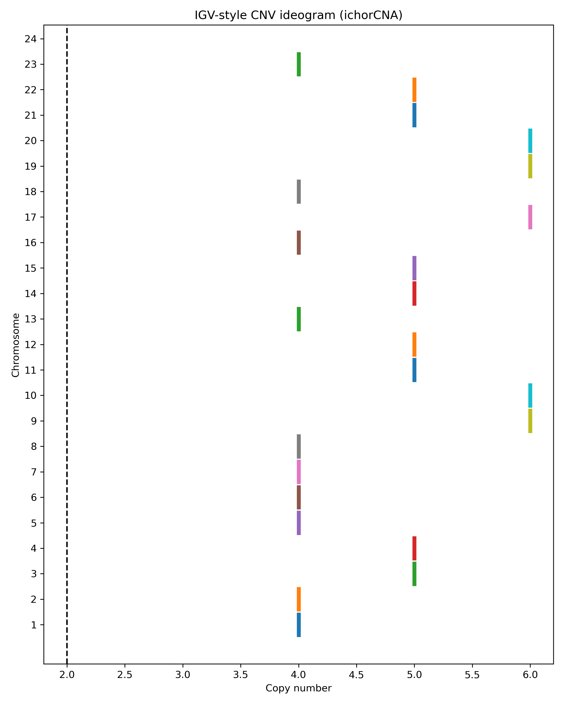

# cfDNA Copy Number Variation (CNV) Pipeline

This repository contains a complete bioinformatics pipeline for estimating tumor fraction and detecting copy number alterations from cell-free DNA (cfDNA) sequencing data using **ichorCNA** and **HMMcopy**.

## Pipeline Architecture
The pipeline follows a standardized workflow to correct for technical biases inherent in liquid biopsy sequencing:

1. **Data Synchronization**: Aligning tumor WIG files with GC and Mappability reference files at 1MB (1000kb) resolution.
2. **Bias Correction**: Applying LOESS regression to normalize read depth based on GC-content and genomic mappability.
3. **Segmentation**: Using a Hidden Markov Model (HMM) to partition the genome into discrete copy number states.
4. **Purity Estimation**: Executing an Expectation-Maximization (EM) algorithm to calculate the final tumor fraction (nethct).


## Installation
Ensure you have R and Conda installed. 

```bash
# Install core R libraries
Rscript -e 'install.packages("remotes", repos="https://cloud.r-project.org")'
Rscript -e 'remotes::install_github("broadinstitute/ichorCNA")'

# Install system dependencies via Conda
conda install -c bioconda bioconductor-hmmcopy r-data.table -y
```

## Usage
Run the main analysis script from the project root:

```bash
Rscript scripts/runIchorCNA.R \
  --id SRR5543231_Final \
  --WIG data/tumour_final.wig \
  --gcWig data/gc_hg38_1000kb.wig \
  --mapWig data/map_hg38_1000kb.wig \
  --ploidy "c(2,3)" \
  --normal "c(0.5, 0.6, 0.7, 0.8, 0.9)" \
  --genomeBuild hg38 \
  --outDir results/ichor
```

## Visualizations and Results
### Copy Number Profile
The plot below displays the normalized log2 ratios across the genome. Red segments indicate gains, while blue segments indicate losses.



### Whole Genome Ideogram
This visualization maps the HMM-based calls onto the human idiogram for chromosomal context.



## Parameters
The critical output is found in `SRR5543231_Final.params.txt`.
- **nethct**: Final estimated tumor fraction.
- **purity**: The percentage of tumor content.
- **ploidy**: The average DNA content of the tumor cells.
