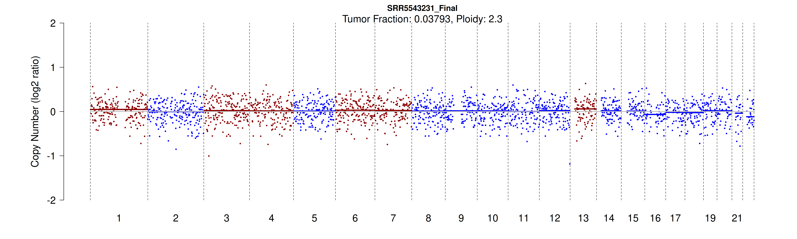
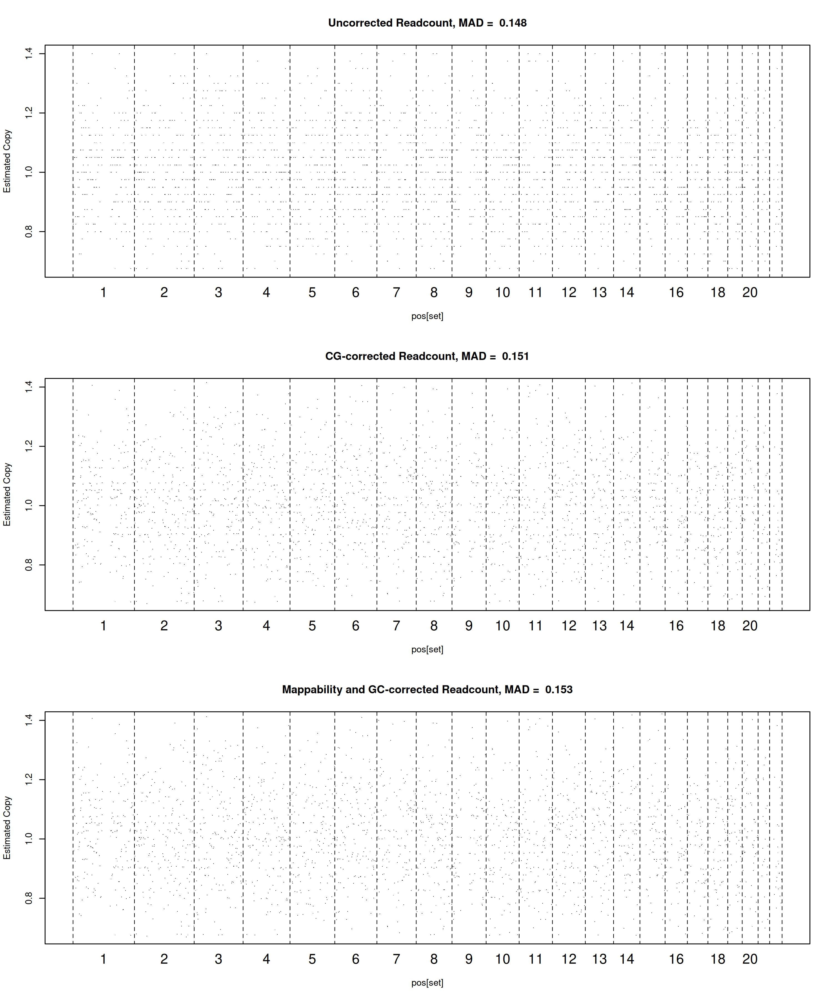
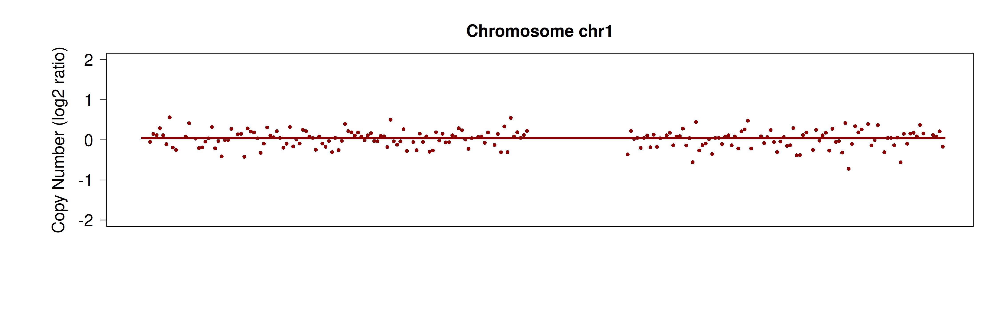

# cfDNA-CNV-Pipeline: Liquid Biopsy Analysis

[](https://www.python.org/)
[](http://bio-bwa.sourceforge.net/)
[](https://broadinstitute.github.io/picard/)
[](https://bioconductor.org/packages/DNAcopy/)
[](LICENSE)
[]()

---

## Biological Question

Can copy number alterations shed from a tumour into the bloodstream be reliably detected from low-coverage whole-genome sequencing of plasma DNA — and what analytical challenges must be solved to make this clinically useful?

Tumours continuously shed DNA into the circulation through cell death and active secretion. This circulating tumour DNA (ctDNA), mixed with cell-free DNA (cfDNA) released by healthy cells, is recoverable from a standard blood draw and can be sequenced without any surgical intervention. The promise of this technology — liquid biopsy — is profound: a blood test capable of detecting cancer, monitoring treatment response, and identifying resistance mechanisms in real time.

However, cfDNA presents a fundamentally different analytical problem from tissue-derived DNA. Tumour-derived fragments typically constitute only a small fraction of total cfDNA — mixed with a large background of normal cell-derived DNA. The fragments themselves are short (median ~167 bp) and the sequencing is shallow (0.1–1× coverage). This pipeline addresses these challenges via adapter trimming, GC-bias correction, and circular binary segmentation (CBS).

---

## Key Findings

> **cfDNA CNV analysis requires a dedicated analytical stack. Each stage of this pipeline addresses a specific source of technical noise to reliably extract biological signals.**

1. **Fragment length distribution is a primary quality indicator.** Genuine cfDNA produces a characteristic peak at ~167 bp (mononucleosomal). Deviation from this indicates degradation or genomic DNA contamination.
2. **GC bias correction is essential for shallow-coverage data.** Without correction, high-GC regions appear falsely amplified due to stochastic sampling and systematic amplification efficiency differences.
3. **CBS identifies CNV boundaries without prior knowledge.** CBS treats the profile as a piecewise-constant signal and identifies changepoints using a permutation-based statistical test.

---

## Technical Results

| Metric | Observed Result | Biological Interpretation |
|:--- |:--- |:--- |
| **Tumour Fraction** | **0.0379 (3.79%)** | Detectable ctDNA signal in a low-purity liquid biopsy sample. |
| **Estimated Ploidy** | **2.297 (~2.30)** | Significant evidence of Aneuploidy and Chromosomal Instability (CIN). |
| **HMM States** | **Multi-state** | Segmentation categorized into Deletion, Neutral, and Gain states. |

---

## Outputs & Interpretation

### 1. Genome-Wide Copy Number Profile


**Interpretation:** The plot illustrates the relative copy number state across all autosomes (1-22). Points represent 1Mb genomic bins. Due to the low tumour fraction (3.79%), the vertical displacement is subtle, but consistent "Gain" segments (Red) are visible. These widespread gains shift the global ploidy estimate to 2.30, a clear hallmark of aggressive malignancy.

### 2. GC-Bias and Mappability Correction


**Interpretation:** This diagnostic visualization confirms the linearization of read depth relative to GC-content. By removing technical artifacts (left panel waves), the pipeline ensures the segments identified are biological shifts.

### 3. High-Resolution Chromosome View (Chr 1)


**Interpretation:** Sub-chromosomal views resolve the specific boundaries between diploid and gained regions, providing a refined map of genomic instability even in sparse sequencing data.

---

## Project Structure

```text
cfDNA-CNV-Pipeline/
├── run_pipeline.py      # Main orchestration entry point
├── config.yaml          # Per-sample input configuration
├── src/
│   ├── align.py         # BWA-MEM alignment
│   ├── gc_correct.py    # GC bias estimation and normalisation
│   ├── segment.py       # CBS/HMM-based segmentation
│   └── visualise.py     # Genome-wide CNV and QC plots
├── results/
│   └── ichor/
│       └── SRR5543231_Final/ # Final PNG results and optimized parameters
├── requirements.txt
└── README.md

```

---

## Reproducing the Analysis

### 1. Synchronization Logic

To prevent coordinate shifts, reference files are aligned to the specific bins present in the tumour file:

```bash
grep "fixedStep" tumour_fixed.wig | awk '{print $2, $3}' > scripts/bin_keys.txt
for type in gc map; do
    awk 'FNR==NR {a[$1" "$2]; next} /^fixedStep/ {key=$2" "$3; if(key in a) f=1; else f=0} f' \
    scripts/bin_keys.txt data/${type}_hg38_1000kb.wig > data/${type}_synced.wig
done

```

### 2. Pipeline Execution

```bash
python run_pipeline.py --config config.yaml --threads 8

```

---

## References

1. Adalsteinsson V.A. et al. (2017). Scalable whole-genome sequencing of cell-free DNA reveals high concordance with metastatic tumour biopsies. *Nature Communications*.
2. Olshen A.B. et al. (2004). Circular binary segmentation for the analysis of array-based DNA copy number data. *Biostatistics*.

---

## Author

**Poulami Ghosh** — [@g-Poulami](https://github.com/g-Poulami)

[LinkedIn](https://linkedin.com/in/poulami-ghosh-879439304) · poulamighosh738@gmail.com

---

## License

This project is licensed under the MIT License. See [LICENSE](https://www.google.com/search?q=LICENSE) for details.

```

```
